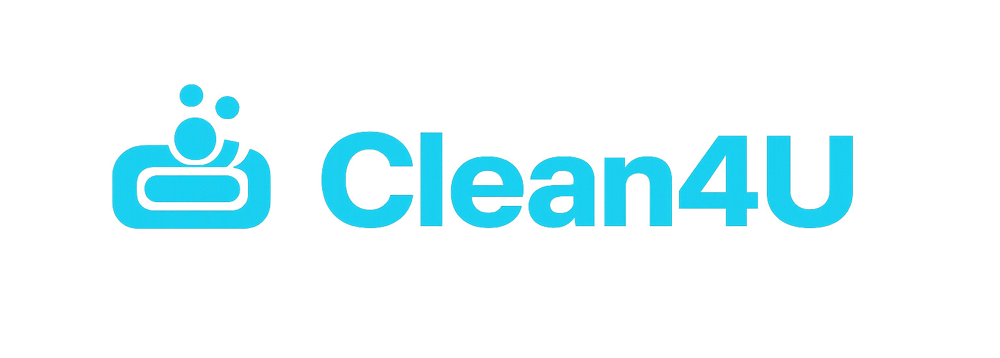
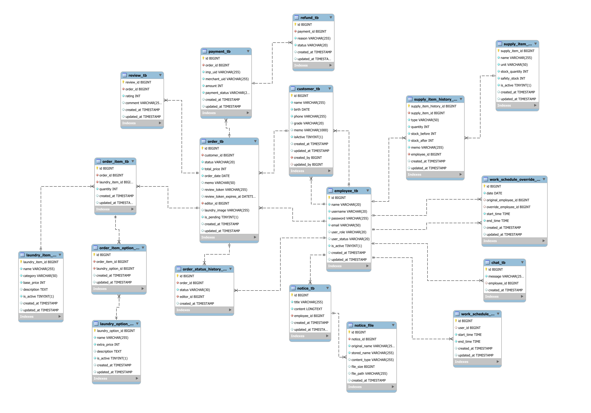

# 🧺 Clean4U - 세탁소 운영 관리 시스템


## 🚀 프로젝트 개요

Clean4U는 세탁소를 대상으로 고객 등록부터 세탁물 접수, 품목 및 옵션 기반 금액 계산, 처리 단계 관리, 직원 스케줄링, 재고 관리에 이르기까지 세탁소 운영의 전 과정을 하나의 서비스로 통합한 웹 기반 관리 플랫폼입니다.

### 🔍 해결하고자 하는 문제

현재 많은 세탁소는 고객 정보 관리, 세탁물 접수, 가격표 및 옵션 관리, 직원 근무 일정, 처리 단계 추적, 재고 관리 등을 전화, 수기 기록, 종이 접수증, 엑셀 등으로 개별 관리하고 있어 다음과 같은 문제가 발생합니다:

- 접수 누락 및 가격 계산 오류
- 처리 단계 미공유로 인한 업무 혼선
- 직원 스케줄 충돌
- 재고 파악 지연
- 운영 데이터 부재

### ✨ 제공하는 가치

- **고객**: 주문 상태 변경에 따른 알림 경험 제공, 리뷰 등록을 통한 피드백 참여
- **직원**: 명확한 업무 흐름과 근무 관리 환경 제공
- **운영팀**: 가격, 재고, 통계를 기반으로 한 안정적인 운영 도구 제공

## 🛠 기술 스택

### Backend


---

### Frontend


---

### External API


---

### Tools


## 📂 프로젝트 구조

```
📦clean4u
 ┣ 📂src
 ┃ ┣ 📂main
 ┃ ┃ ┣ 📂java
 ┃ ┃ ┃ ┗ 📂org
 ┃ ┃ ┃   ┗ 📂example
 ┃ ┃ ┃     ┗ 📂clean4u
 ┃ ┃ ┃       ┣ 📂_core                 # 공통 기능
 ┃ ┃ ┃       ┃ ┣ 📂config              # 설정 (WebMvcConfig등)
 ┃ ┃ ┃       ┃ ┣ 📂errors              # 예외 처리 및 핸들러(GlobalExceptionHandler 등)
 ┃ ┃ ┃       ┃ ┣ 📂interceptor         # 권한 및 세션 체크(AuthInterceptor, AccessInterceptor, SessionInterceptor)
 ┃ ┃ ┃       ┃ ┣ 📂response            # 응답 DTO
 ┃ ┃ ┃       ┃ ┗ 📂utils               # 유틸리티 (FileUtil, PriceUtil 등)
 ┃ ┃ ┃       ┣ 📂chat                  # 채팅 관리
 ┃ ┃ ┃       ┣ 📂client                # 사용자 페이지
 ┃ ┃ ┃       ┣ 📂customer              # 고객 관리
 ┃ ┃ ┃       ┣ 📂dashboard             # 통계 및 대시보드
 ┃ ┃ ┃       ┣ 📂employee              # 직원 관리
 ┃ ┃ ┃       ┣ 📂laundry               # 세탁 품목
 ┃ ┃ ┃       ┣ 📂laundryOption         # 세탁 옵션
 ┃ ┃ ┃       ┣ 📂notice                # 공지사항
 ┃ ┃ ┃       ┣ 📂order                 # 주문 관리
 ┃ ┃ ┃       ┣ 📂orderItem             # 주문 항목
 ┃ ┃ ┃       ┣ 📂orderItemOption       # 주문 항목 옵션
 ┃ ┃ ┃       ┣ 📂orderStatusHistory    # 주문 상태 이력
 ┃ ┃ ┃       ┣ 📂payment               # 결제
 ┃ ┃ ┃       ┣ 📂refund                # 환불
 ┃ ┃ ┃       ┣ 📂review                # 고객 리뷰
 ┃ ┃ ┃       ┣ 📂sms                   # 문자 발송 서비스
 ┃ ┃ ┃       ┣ 📂supplyItem            # 재고 품목
 ┃ ┃ ┃       ┣ 📂supplyItemHistory     # 재고 이력
 ┃ ┃ ┃       ┗ 📂workschedule          # 근무 스케줄
 ┃ ┃ ┣ 📂resources
 ┃ ┃ ┃ ┣ 📂db                          # 초기 데이터 (data.sql)
 ┃ ┃ ┃ ┣ 📂static                      # 정적 리소스(CSS, JS)
 ┃ ┃ ┃ ┣ 📂templates                   # Mustache 템플릿
 ┃ ┃ ┃ ┗ 📜application*.yml
 ┃ ┗ 📂test                            # 테스트 코드
 ┣ 📜.env                              # 환경 변수 파일 (프로젝트 루트에 생성 필요)
 ┣ 📜build.gradle                      # Gradle 빌드 설정
 ┣ 📜gradlew.bat                       # Gradle Wrapper (Windows)
 ┗ 📜gradlew                           # Gradle Wrapper (Linux/Mac)
 
```

## 📌 주요 기능

### 1. 고객 관리
- 고객 등록, 조회, 수정, 삭제
- 고객 등급 관리 (NEW, REGULAR, VIP)
- 고객 등급 자동 변경 (주문 횟수에 따른 등급 업그레이드)
- 고객 검색 기능 (이름, 전화번호, 등급별)
- 고객별 주문 이력 조회
- 고객 비활성화/활성화 기능
- 페이징 처리

### 2. 직원 관리
- 직원 가입 및 로그인/로그아웃
- 직원 승인 대기 시스템 (관리자 승인 필요)
- 직원 조회, 수정, 비활성화
- 권한 관리 (관리자/일반직원)
- 직원 상태 관리 (승인대기/승인/거부)
- 이메일 인증 기능
- 비밀번호 찾기 및 재설정

### 3. 주문 관리
- 주문 생성 (고객 선택, 세탁 품목/옵션 선택, 금액 자동 계산)
- 주문 조회, 수정, 삭제 (소프트/하드 삭제)
- 주문 상태 관리 (접수/세탁중/건조중/완료/취소)
- 주문 상태 변경 이력 기록
- 주문 검색 및 필터링 (고객명, 전화번호, 세탁 상태, 날짜)
- 세탁물 이미지 업로드 및 삭제
- 결제 완료/취소 상태 관리
- 상태 변경시, 세탁 완료시 리뷰 링크 SMS 발송
- 세탁 완료시 누적 횟수 계산하여 등급 자동 갱신

### 4. 세탁 품목 및 옵션 관리
- 세탁 품목 등록(카테고리 선택, 기본 가격 설정)
- 세탁 품목 조회, 수정, 삭제
- 세탁 옵션 등록, 조회, 수정
- 품목 및 옵션 활성화/비활성화 관리

### 5. 결제 시스템
- 포트원(PortOne) 결제 API 연동
- 결제 준비 및 검증 프로세스(결제 금액 위변조 및 중복 결제 방지)
- 결제 상태 관리 (PAID, REFUNDED)
- 결제 이력 저장
- 환불 처리, 환불 상태 관리(대기, 완료, 취소)

### 6. 리뷰 시스템
- 토큰 기반 리뷰 작성 (고객용)
- 주문 완료 후 리뷰 토큰 발급
- 리뷰 작성 완료 페이지

### 7. 재고 관리
- 비품 등록, 조회, 수정, 삭제
- 재고 수량 관리
- 안전 재고 설정
- 재고 부족 알림 (대시보드)
- 재고 입출고 이력 기록 (입고/출고 구분)
- 재고 변동 추적
- 재고 품목 활성화/비활성화 관리

### 8. 공지사항 관리
- 공지사항 작성, 조회, 수정, 삭제 (관리자 전용)
- 이미지 첨부 기능
- 페이징 처리
- 이전/다음 공지 이동

### 9. 직원 스케줄 관리
- 정규 스케줄 등록, 조회, 수정, 삭제
- 스케줄 검색 (이름, 아이디, 시간대)
- 병결 처리 (Override 스케줄)
- 스케줄 대체 직원 지정

### 10. 대시보드 
- 통계 데이터 제공:
  - 가장 많이 주문된 세탁 품목 카테고리
  - 가장 많이 주문된 세탁 옵션
  - 재고 부족 비품 목록
  - 진행 중인 주문 수 (세탁중/건조중)
  - 평균 처리 경과 시간
  - 금일 완료 주문 수
  - 금일 접수 주문 수 및 매출
  - 고객 등급별 평균 소비 금액
- 관리자/일반직원 대시보드 분리

### 11. 클라이언트 페이지
- 고객용 주문 조회 페이지
- 전화번호 기반 주문 조회
- 주문 상세 조회
- 주문 통계 정보

## 📑 ERD
- 테이블 명세서:
https://docs.google.com/spreadsheets/d/1oQE-sOg5siyEm8UOxROl1Bf-ADSyR2eBmO4GLJtp7_o/edit?gid=0#gid=0


## ⚙️ 실행 방법

### 사전 요구사항
- JDK 17 이상
- MySQL 8.0 이상 (운영 환경) 또는 H2 (개발 환경)
- Gradle 7.x 이상

### 환경 변수 설정

프로젝트 루트(`clean4u/`)에 `.env` 파일을 생성하고 다음 환경 변수를 설정하세요:

> **참고**: 이 프로젝트는 `spring-dotenv` 라이브러리를 사용하여 `.env` 파일에서 환경 변수를 로드합니다.

```env
# 데이터베이스 설정
DB_HOST=localhost
DB_PORT=3306
DB_NAME=clean4u
DB_USERNAME=root
DB_PASSWORD=your_password

# 이메일 설정
MAIL_USERNAME=your_email@gmail.com
MAIL_PASSWORD=your_app_password

# 포트원 결제 API
IMP_REST_API_KEY=your_portone_key
IMP_SECRET_KEY=your_portone_secret

# SolAPI SMS
SOLAPI_API_KEY=your_solapi_key
SOLAPI_API_SECRET=your_solapi_secret
FROM=your_phone_number

# 애플리케이션 기본 URL
BASE_URL=http://localhost:8080
```

### 빌드 및 실행

#### Windows 환경
```bash
# 프로젝트 클론
git clone [repository-url]
cd Clean4U/clean4u

# Gradle 빌드
gradlew.bat build

# 애플리케이션 실행
gradlew.bat bootRun

# 또는 JAR 파일로 실행
java -jar build/libs/clean4u-0.0.1-SNAPSHOT.jar
```

#### Linux/Mac 환경
```bash
# 프로젝트 클론
git clone [repository-url]
cd Clean4U/clean4u

# Gradle 빌드
./gradlew build

# 애플리케이션 실행
./gradlew bootRun

# 또는 JAR 파일로 실행
java -jar build/libs/clean4u-0.0.1-SNAPSHOT.jar
```

### 접속 정보

- **애플리케이션**: http://localhost:8080/login
- **Swagger UI**: http://localhost:8080/swagger-ui.html
- **API Docs (JSON)**: http://localhost:8080/v3/api-docs
- **H2 Console** (개발 환경): http://localhost:8080/h2-console

## 🔗 URL 매핑

### 인증 및 인가

| HTTP Method | URL | 설명 | 권한 | 비고 |
|------------|-----|------|------|------|
| GET | `/employees/new` | 직원 가입 화면 | 비로그인 | - |
| POST | `/employees/new` | 직원 가입 처리 | 비로그인 | - |
| GET | `/login` | 로그인 화면 | 비로그인 | - |
| POST | `/login` | 로그인 처리 | 비로그인 | - |
| DELETE | `/api/v1/sessions` | 로그아웃(API) | 로그인 필요 | - |
| GET | `/dashboard` | 대시보드 | 로그인 필요 | - |
| GET | `/employees/me` | 내 정보 수정 화면 | 로그인 필요 | - |
| PUT | `/api/v1/employees/me` | 내 정보 수정 처리(API) | 로그인 필요 | - |
| POST | `/api/v1/email/send` | 이메일 인증번호 발송 (API) | 비로그인 | - |
| POST | `/api/v1/email/verify` | 이메일 인증번호 확인 (API) | 비로그인 | - |
| GET | `/password` | 비밀번호 찾기 화면 | 비로그인 | - |
| POST | `/password` | 비밀번호 찾기 처리 | 비로그인 | - |
| GET | `/password/reset` | 비밀번호 재설정 화면 | 비로그인 | - |
| POST | `/password/reset` | 비밀번호 재설정 처리 | 비로그인 | - |

### 고객 관리

| HTTP Method | URL | 설명 | 권한 | 비고 |
|------------|-----|------|------|------|
| GET | `/customers/new` | 고객 등록 화면 | 로그인 필요 | - |
| POST | `/customers/new` | 고객 등록 처리 | 로그인 필요 | - |
| GET | `/customers` | 고객 목록 조회 | 로그인 필요 | - |
| GET | `/customers/{customerId}` | 고객 상세 조회 | 로그인 필요 | - |
| GET | `/customers/{customerId}/edit` | 고객 수정 화면 | 로그인 필요 | - |
| POST | `/customers/{customerId}/status` | 고객 상태 비활성화 | 로그인 필요 | - |
| PUT | `/api/v1/customers/{customerId}` | 고객 정보 수정 (API) | 로그인 필요 | - |
| DELETE | `/api/v1/customers/{customerId}` | 고객 삭제 (API) | 로그인 필요 | - |

### 직원 관리

| HTTP Method | URL | 설명 | 권한 | 비고 |
|------------|-----|------|------|------|
| GET | `/admin/employees/pending` | 가입 대기 목록 | 관리자 | - |
| GET | `/admin/employees` | 직원 목록 조회 | 관리자 | - |
| GET | `/admin/employees/{employeeId}` | 직원 상세 조회 | 관리자 | - |
| POST | `/admin/employees/{employeeId}` | 직원 승인,거부 | 관리자 | - |
| POST | `/admin/employees/{employeeId}/deactivate` | 직원 비활성화 | 관리자 | - |
| GET | `/api/v1/admin/option-chart` | 옵션 차트 데이터 (API) | 관리자 | - |
| GET | `/api/v1/admin/category-revenue-chart` | 카테고리 매출 차트 데이터 (API) | 관리자 | - |
| GET | `/api/v1/admin/monthly-trend-chart` | 월별 매출 추이 차트 데이터 (API) | 관리자 | - |

### 주문 관리

| HTTP Method | URL | 설명 | 권한 | 비고 |
|------------|-----|------|------|------|
| GET | `/orders/new` | 주문 등록 화면 | 로그인 필요 | - |
| POST | `/orders/new` | 주문 등록 처리 | 로그인 필요 | - |
| GET | `/orders` | 주문 목록 조회 | 로그인 필요 | - |
| GET | `/orders/{orderId}` | 주문 상세 조회 | 로그인 필요 | - |
| GET | `/orders/{orderId}/edit` | 주문 수정 화면 | 로그인 필요 | -|
| PUT | `/api/v1/orders/{orderId}` | 주문 수정 (API) | 로그인 필요 | - |
| DELETE | `/api/v1/orders/{orderId}/laundry-image` | 주문 이미지 삭제 (API) | 로그인 필요 | - |
| DELETE | `/api/v1/orders/{orderId}` | 주문 삭제 (API) | 로그인 필요 | - |
| POST | `/orders/{orderId}/review-link` | 리뷰 링크 SMS 발송 | 로그인 필요 | - |
| GET | `/order-status-histories` | 주문 상태 변경 내역 조회 | 로그인 필요 | - |

### 세탁 품목 관리

| HTTP Method | URL | 설명 | 권한 | 비고 |
|------------|-----|------|------|------|
| GET | `/laundry-items` | 세탁 품목 목록 조회 | 로그인 필요 | - |
| GET | `/laundry-items/{laundryItemId}` | 세탁 품목 상세 조회 | 로그인 필요 | - |
| GET | `/laundry-items/new` | 세탁 품목 등록 화면 | 로그인 필요 | - |
| POST | `/laundry-items/new` | 세탁 품목 등록 처리 | 로그인 필요 | - |
| GET | `/laundry-items/{laundryItemId}/edit` | 세탁 품목 수정 화면 | 로그인 필요 | - |
| POST | `/laundry-items/{laundryItemId}/status` | 세탁 품목 비활성화/활성화 | 로그인 필요 | - |
| PUT | `/api/v1/laundry-items/{laundryItemId}` | 세탁 품목 수정 (API) | 로그인 필요 | - |
| DELETE | `/api/v1/laundry-items/{laundryItemId}` | 세탁 품목 삭제 (API) | 로그인 필요 | - |

### 세탁 옵션 관리

| HTTP Method | URL | 설명 | 권한 | 비고 |
|------------|-----|------|------|------|
| GET | `/laundry-options` | 세탁 옵션 목록 조회 | 로그인 필요 | - |
| GET | `/laundry-options/{laundryOptionId}` | 세탁 옵션 상세 조회 | 로그인 필요 | - |
| GET | `/laundry-options/new` | 세탁 옵션 등록 화면 | 로그인 필요 | - |
| POST | `/laundry-options/new` | 세탁 옵션 등록 처리 | 로그인 필요 | - |
| GET | `/laundry-options/{laundryOptionId}/edit` | 세탁 옵션 수정 화면 | 로그인 필요 | - |
| POST | `/laundry-options/{laundryOptionId}/status` | 세탁 옵션 활성화/비활성화 | 로그인 필요 | - |
| PUT | `/api/v1/laundry-options/{laundryOptionId}` | 세탁 옵션 수정 (API) | 로그인 필요 | - |

### 재고 관리

| HTTP Method | URL | 설명 | 권한 | 비고 |
|------------|-----|------|------|------|
| GET | `/supply-items` | 재고 품목 목록 조회 | 로그인 필요 | - |
| GET | `/supply-items/{supplyItemId}` | 재고 품목 상세 조회 | 로그인 필요 | - |
| GET | `/supply-items/new` | 재고 품목 등록 화면 | 로그인 필요 | - |
| POST | `/supply-items/new` | 재고 품목 등록 처리 | 로그인 필요 | - |
| GET | `/supply-items/{supplyItemId}/edit` | 재고 품목 수정 화면 | 로그인 필요 | - |
| POST | `/supply-items/{supplyItemId}/status` | 재고 품목 활성화/비활성화 | 로그인 필요 | - |
| PUT | `/api/v1/supply-items/{supplyItemId}` | 재고 품목 수정 (API) | 로그인 필요 | - |
| GET | `/supply-item-histories` | 재고 이력 목록 조회 | 로그인 필요 | - |
| GET | `/supply-item-histories/{historyId}` | 재고 이력 상세 조회 | 로그인 필요 | - |

### 공지사항 관리

| HTTP Method | URL | 설명 | 권한 | 비고 |
|------------|-----|------|------|------|
| GET | `/notices/new` | 공지사항 작성 화면 | 관리자 | - |
| POST | `/notices/new` | 공지사항 작성 처리 | 관리자 | - |
| GET | `/notices` | 공지사항 목록 조회 | 로그인 필요 | - |
| GET | `/notices/{noticeId}` | 공지사항 상세 조회 | 로그인 필요 | - |
| GET | `/notices/{noticeId}/edit` | 공지사항 수정 화면 | 관리자 | - |
| PUT | `/api/v1/notices/{noticeId}` | 공지사항 수정 (API) | 관리자 | - |
| DELETE | `/api/v1/notices/{noticeId}` | 공지사항 삭제 (API) | 관리자 | - |
| POST | `/api/v1/notices/image` | 공지사항 본문 내 이미지 삽입 | 관리자 | - |
| GET | `/api/v1/files/{fileId}` | 첨부 파일 다운로드 | 관리자 | - |


### 결제 및 환불

| HTTP Method | URL | 설명 | 권한 | 비고 |
|------------|-----|------|------|------|
| GET | `/payments` | 결제 목록 조회 | 로그인 필요 | - |
| POST | `/api/v1/payments/prepare` | 결제 준비 (API) | 로그인 필요 | - |
| POST | `/api/v1/payments/verify` | 결제 검증 (API) | 로그인 필요 | - |
| GET | `/refunds/{paymentId}` | 환불 요청 화면 | 로그인 필요 | - |
| POST | `/api/v1/refunds/{paymentId}` | 환불 처리 (API) | 로그인 필요 | - |

### 리뷰

| HTTP Method | URL | 설명 | 권한 | 비고 |
|------------|-----|------|------|------|
| GET | `/r/{token}` | 리뷰 작성 페이지 리다이렉트 | 비로그인 | - |
| GET | `/review/new` | 리뷰 작성 화면 | 비로그인 (토큰 필요) | - |
| POST | `/review/new` | 리뷰 작성 처리 | 비로그인 (토큰 필요) | - |

### 근무 스케줄 관리

| HTTP Method | URL | 설명 | 권한 | 비고 |
|------------|-----|------|------|------|
| GET | `/schedules/employees` | 직원 조회 (스케줄 등록용) | 관리자 | - |
| GET | `/schedules/{employeeId}/new` | 스케줄 등록 화면 | 관리자 | - |
| POST | `/schedules/new` | 스케줄 등록 처리 | 관리자 | - |
| GET | `/schedules` | 스케줄 목록 조회 | 관리자 | - |
| GET | `/schedules/{scheduleId}` | 스케줄 상세 조회 | 관리자 | - |
| GET | `/schedules/{scheduleId}/edit` | 스케줄 수정 화면 | 관리자 | - |
| PUT | `/api/v1/schedules/{scheduleId}/edit` | 스케줄 수정 처리 | 관리자 | - |
| DELETE | `/api/v1/schedules/{scheduleId}` | 스케줄 삭제 | 관리자 | - |
| GET | `/schedule-overrides` | 대체 스케줄 목록 조회 | 관리자 | - |
| GET | `/schedule-overrides/{overrideId}` | 대체 스케줄 상세 조회 | 관리자 | - |
| GET | `/schedule-overrides/{overrideId}/edit` | 대체 스케줄 수정 화면 | 관리자 | - |
| PUT | `/api/v1/schedule-overrides/{overrideId}/edit` | 대체 스케줄 수정 처리 | 관리자 | - |
| DELETE | `/api/v1/schedule-overrides/{overrideId}` | 대체 스케줄 삭제 | 관리자 | - |

### 클라이언트 페이지

| HTTP Method | URL | 설명 | 권한 | 비고 |
|------------|-----|------|------|------|
| GET | `/client` | 클라이언트 메인 페이지 | 비로그인 | - |
| GET | `/client/{phone}/orders` | 고객 주문 목록 조회 | 비로그인 | - |
| GET | `/client/{phone}/orders/{orderId}` | 고객 주문 상세 조회 | 비로그인 | - |

### 채팅

| HTTP Method | URL | 설명 | 권한 | 비고 |
|------------|-----|------|------|------|
| GET | `/chats` | 채팅 페이지 | 로그인 필요 | - |
| GET | `/api/v1/chats` | 채팅 스트림 (SSE) | 로그인 필요 | - |
| GET | `/api/v1/chats/history` | 채팅 이력 조회 (API) | 로그인 필요 | - |
| POST | `/api/v1/chats` | 채팅 메시지 전송 (API) | 로그인 필요 | - |

## 🛠️ 주요 기술 특징

### 보안
- BCrypt를 이용한 비밀번호 암호화
- 세션 기반 인증
- 인터셉터를 통한 접근 제어
- 권한별 기능 분리

### 예외 처리
- 커스텀 예외 클래스 (Exception400, 401, 403, 404, 500)
- GlobalExceptionHandler를 통한 전역 예외 처리
- 사용자 친화적 에러 메시지 제공

### 데이터베이스
- JPA를 통한 ORM
- 인덱스 최적화
- 트랜잭션 관리
- N+1 문제 해결 (default_batch_fetch_size 설정)

### 파일 업로드
- 이미지 파일 업로드 지원 (주문 세탁물 이미지, 공지사항 이미지)
- 파일 유효성 검증 (이미지 파일만 허용)
- UUID 기반 파일명 생성
- 최대 파일 크기: 10MB
- 파일 저장 경로: `C:/uploads/` (Windows 환경)

## 개발 환경 설정

### IDE 설정
- IntelliJ IDEA 권장
- Lombok 플러그인 설치 필요
- Java 17 SDK 설정

### 데이터베이스 설정

#### 개발 환경 (H2)
- H2 데이터베이스 사용 (운영 환경에서는 MySQL 사용)
- H2 Console 활성화: http://localhost:8080/h2-console
- JDBC URL: `jdbc:h2:mem:test;MODE=MySQL` (인메모리 모드)
- **주의**: `application-dev.yml`에서는 MySQL을 사용하도록 설정되어 있습니다. 개발 환경에서 H2를 사용하려면 설정을 변경해야 합니다.

#### 운영 환경 (MySQL)
- MySQL 8.0 이상 필요
- 데이터베이스 생성:
```sql
CREATE DATABASE clean4u CHARACTER SET utf8mb4 COLLATE utf8mb4_unicode_ci;
```

## 👥 기여자
### 👩‍💻 정은혜
* **주문 통계**
    - 오늘 주문/매출, 진행 중인 주문, 완료된 주문 통계
* **주문 관리 시스템**
    - 주문 등록, 조회, 수정, 삭제, 이미지 업로드
* **주문 상태 이력 관리**
    - 주문 상태 변경 이력 추적, SMS 발송
* **결제 시스템**
    - 포트원 연동, 결제 처리, 결제 내역 관리
* **환불 관리 시스템**
    - 환불 요청 처리, 환불 내역 관리
* **채팅 풀페이지**
    - 전체 화면 채팅 시스템
* **공통 기능**
    - API 응답 형식, 페이지네이션, 예외 처리, 날짜/가격 유틸리티, 데이터베이스 초기화 및 설계

### 👩‍💻권지애
* **고객 등급별 평균 소비 금액 통계**
    - 등급별 통계 분석
* **고객 관리 시스템**
    - 고객 등록, 조회, 수정, 등급 관리 
* **공지사항 시스템**
    - 공지사항 작성, 조회, 수정, 삭제, 이미지 업로드
* **공통 레이아웃**
    - 헤더, 푸터 레이아웃 구현
* **공통 기능**
    - 파일 처리 유틸리티, 데이터베이스 초기화 및 설계

### 👩‍💻김지선
* **통계**
    - 인기 세탁 카테고리 통계, 인기 세탁 옵션 통계, 재고 알림 통계
* **세탁 항목 관리 시스템**
    - 세탁 항목 등록, 조회, 수정, 삭제
* **세탁 옵션 관리 시스템**
    - 세탁 옵션 등록, 조회, 수정, 삭제
* **리뷰 시스템**
    - 토큰 기반 리뷰 작성, 리뷰 관리
* **고객용 주문 조회 시스템**
    - 전화번호 기반 주문 조회 (로그인 불필요)
* **재고 관리 시스템**
    - 재고 항목 관리, 입출고 처리, 안전 재고 알림
* **재고 이력 관리 시스템**
    - 재고 변동 이력 추적
* **채팅 위젯**
    - 우측 하단 채팅 위젯 구현
* **공통 UI**
    - 배경 레이아웃, 기본/레이아웃/컴포넌트 CSS, 드롭다운 메뉴, 반응형 디자인, 공통 JavaScript 유틸리티
* **공통 기능**
    - API 응답 형식, 캐시 설정, Swagger/API 문서화, 로깅 시스템, 데이터베이스 초기화 및 설계

### 👩‍💻김태양
* **인증/권한 관리 시스템**
    - 로그인, 회원가입, 비밀번호 재설정, 권한 관리, 이메일 인증
* **직원 관리 시스템**
    - 직원 등록, 조회, 수정, 승인/거부 처리
* **대시보드 시스템**
    - 관리자/직원 대시보드 페이지, 직원 관리 통계, 세탁 옵션 차트 통계, 근무 정보 통계
* **근무 스케줄 관리 시스템**
    - 근무 스케줄 등록, 조회, 수정, 대체 근무 관리
* **공통 기능**
    - 인터셉터 시스템, 이메일 처리 유틸리티, 웹 MVC 설정, 보안 설정, 데이터베이스 초기화 및 설계